# Burhani-Foods-Showcase
A full-stack e-commerce web application for Burhani Foods built with PHP, MySQL, JavaScript, HTML and CSS . Features secure OTP authentication, product and inventory management, cookie-based cart, Cashfree payment integration, automated courier tracking, invoice generation, and an admin dashboard.

## Screenshots
### Home Page
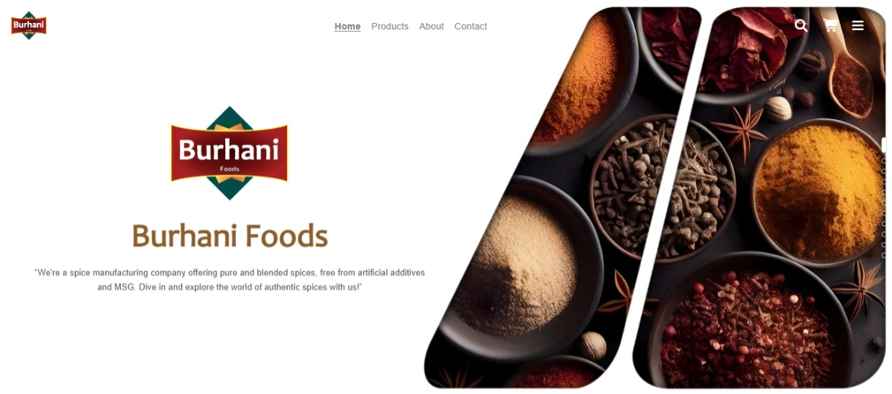
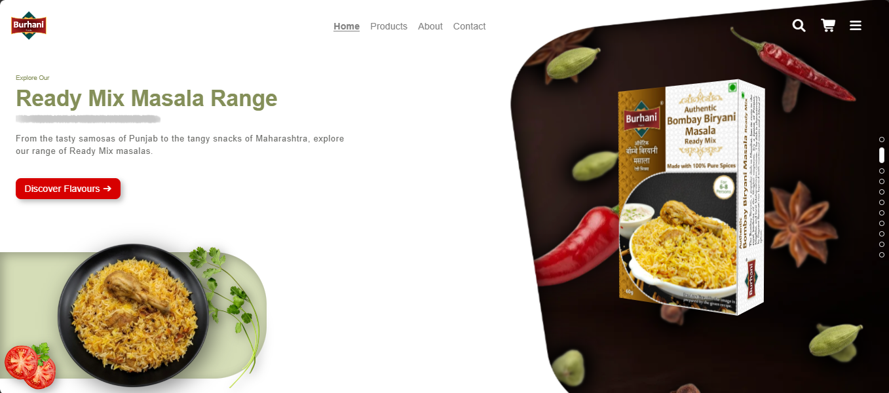
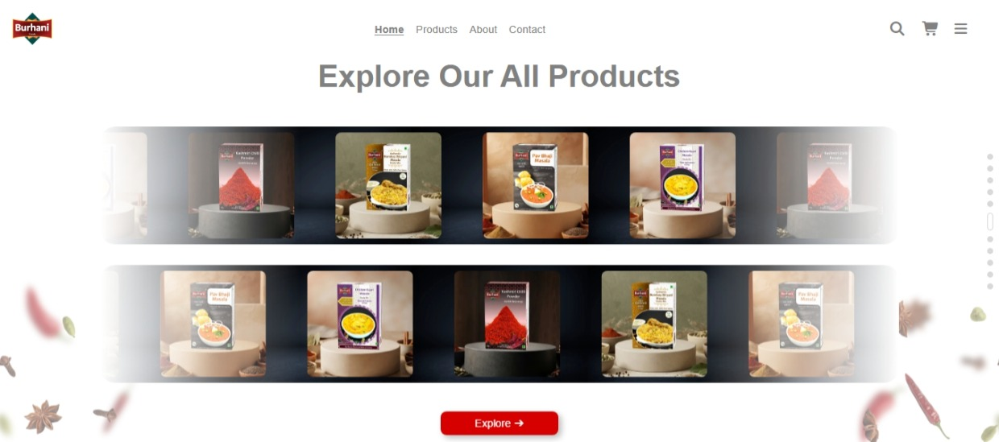

### Cartegories Page
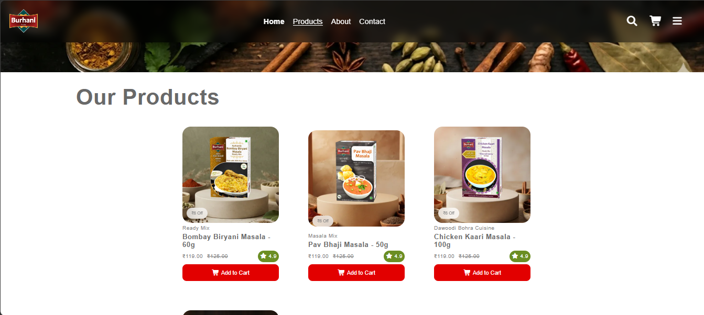

### Product Page
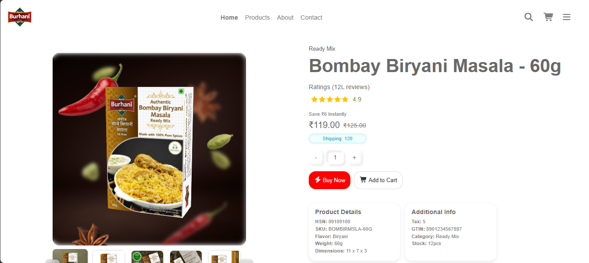

### Cart
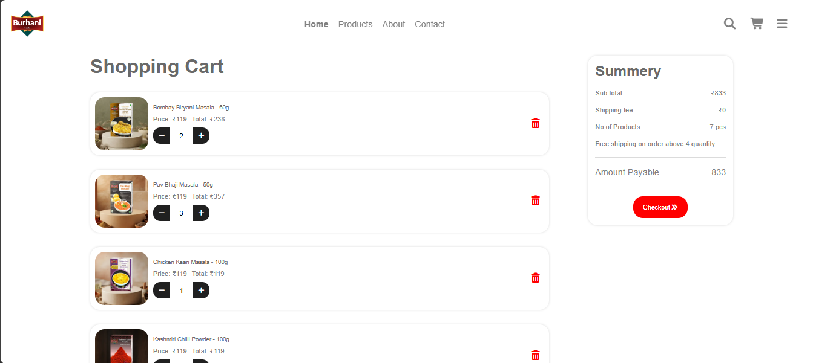

### Checkout Page
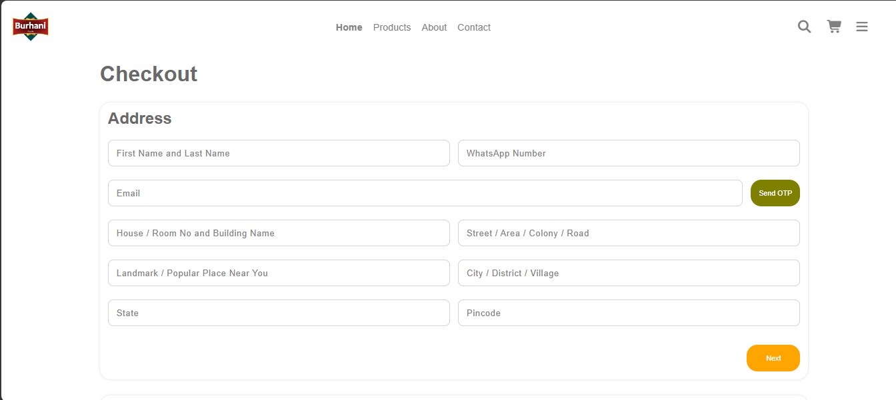
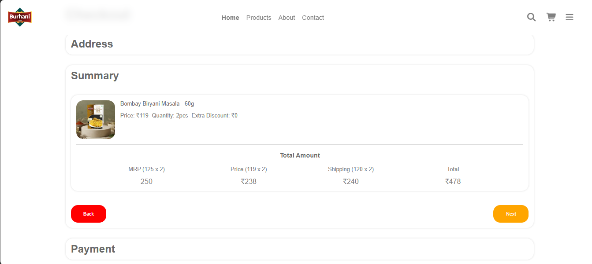

### Thank You Page
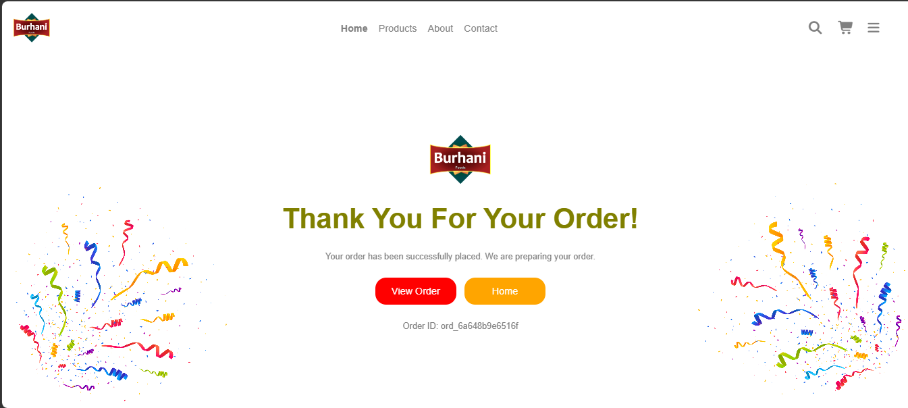

### My Orders
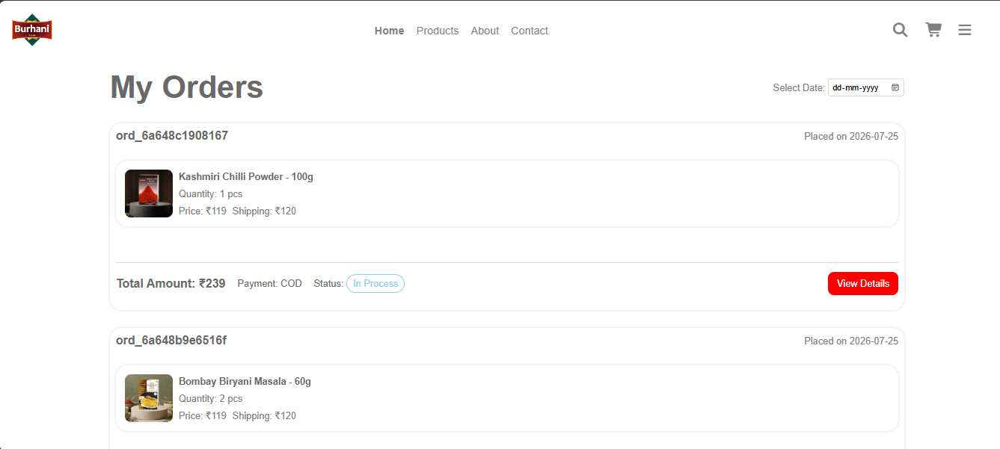

### Search
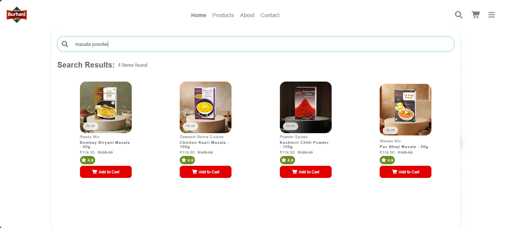
